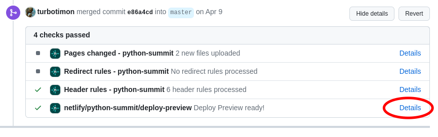

# Static Website for the Swiss Python Summit

See [www.python-summit.ch](https://www.python-summit.ch/)

## Development

### General

* This project is made with [Lektor](https://www.getlektor.com/). Lektor is a static content management and pages can be easy written in Markdown
* The design uses [Spectre](https://picturepan2.github.io/spectre/index.html) as its base. Spectre is a lightweight CSS framework with a lot of components you can use.

### Run website for local development

* Clone the repository or open in GitHub Codespace
* Make a virtual environment and activate it (for some reason, the lektor CLI works only in venv)
* Install requirements with `make install`
* Run Lektor server with `make serve`
* After that the website should be available on port 5000 with hot-reload

### Deployment

* The **main** branch is automatically live deployed with Netlify, so be careful what you push here!
* You can see a preview for reviews in a pull requests:

### Branch and merge rules

Please follow these rules to keep the repo clean:

* Name branches with prefix `spsYY-` e.g. `sps24-open-cfp`

### How to add a talk recording

- Go to http://localhost:5000/admin/root:talk-recordings/edit
- Click "Add Page"
- Choose the "Recording" model
- Set the "Title" field to the talk title
- Click "Add Child Page"
- Fill in the data and save
- Click "Add Attachment"
- Upload PDF file with slides
- Click on the attachment in the left navigation
- Change the attachment type to "Slides"

Note: The playlist URLs are stored in `databags/playlists.json`.
